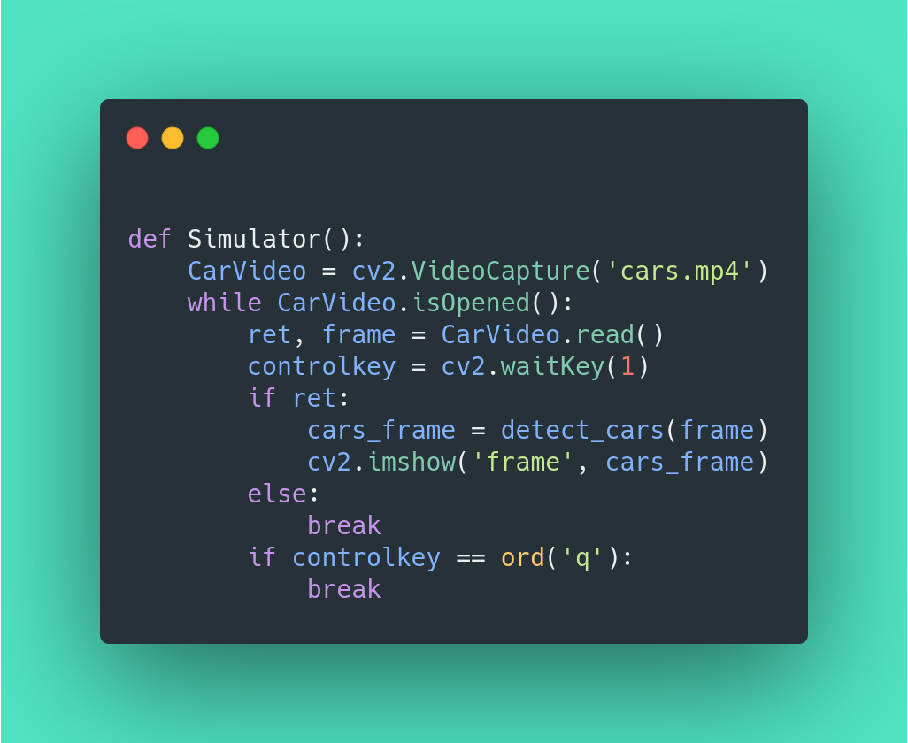

# Real-time-Vehicle-Dection-Python

Intro
----------
This project act as a short guide on how you can get started with *real-time vehicle detection* in python, in this project 
I have used a pretrained cascade model to detect the instances of vehicles in a sample video.

Where is the full article ?
----------------------------
The full article for this project is originally published on [my blog](kalebujordan.com) with an article with title [Real-time vehicle detection in python](https://kalebujordan.com/real-time-vehicle-detection-with-opencv-in-10-minutes/)


Getting started 
----------------
Firstly we have to clone the project repository or download the zip of project and then extract it 


```bash
git clone https://github.com/Kalebu/Real-time-Vehicle-Dection-Python
```

Installation
-------------
Now once we have the project repo in our local directory, noww lets install the dependecies

```bash
pip install opencv-python
```

Sample video
------------
The sample video we used in this project is **cars.mp4** which will come as you download or clone the repository, 
to load a different video with different filename, you might wanna change the source code a bit.





Running the application 
-----------------------
To run the application use direct python commmand, just as shown below;

```bash
python app.py 
```

The Ouput would normally look like this
-----------------------------------------


Credits
-----------
All the credits to [kalebu](github.com/kalebu)