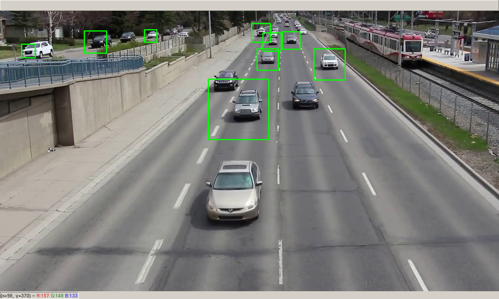

<samp>
    
# [Real-time-Vehicle-Dection-Python](https://kalebujordan.dev/real-time-vehicle-detection-using-python/)

Hi guys, This repository consist of a source code of script to detect cars in a video/camera frame and then draw rectangaluar boxes around them.

The **ML algorithms** used for detecting cars and bounding boxes coordinates is a pretrained cascade model [Haarcascade car](https://github.com/Kalebu/Real-time-Vehicle-Dection-Python/blob/master/haarcascade_car.xml).

[](https://www.patreon.com/kalebujordan)

## Where is the full article ?

The full article for this project is originally published on [my blog](kalebujordan.dev) with an article with title [Real-time vehicle detection in python](https://kalebujordan.dev/real-time-vehicle-detection-using-python/)

## Getting started

Firstly we have to clone the project repository or download the zip of project and then extract it.

```bash
git clone https://github.com/Kalebu/Real-time-Vehicle-Dection-Python
cd Real-time-Vehicle-Dection-Python
Real-time-Vehicle-Dection-Python ->
```

## Dependencies

Now once we have the project repo in our local directory, now lets install the dependecies required to run our script

```bash
pip install opencv-python
```

## Sample video

The sample video we used in this project is [**cars.mp4**](https://github.com/Kalebu/Real-time-Vehicle-Dection-Python/blob/master/cars.mp4) which will come as you download or clone the repository, to load a different video with different filename, you might wanna change the source code a bit.

```python
def Simulator():
    CarVideo = cv2.VideoCapture('cars.mp4') # change cars.mp4 to name of your vidoe
    while CarVideo.isOpened():
        ret, frame = CarVideo.read()
        controlkey = cv2.waitKey(1)
        if ret:        
            cars_frame = detect_cars(frame)
            cv2.imshow('frame', cars_frame)
        else:
            break
        if controlkey == ord('q'):
            break

    CarVideo.release()
    cv2.destroyAllWindows()

```

## **[](./pictures/rocket.png) running our script**

Now you can launch your scripts;

```bash
python app.py 
```

If you use the provided sample video, your script is going to look as shown in the picture below;



## Issues ?

Are you facing any issue while trying to run the script, well then raise an issue and I will do my best fixing it as soon as I can

## Credits

All the credits to [kalebu](github.com/kalebu)
